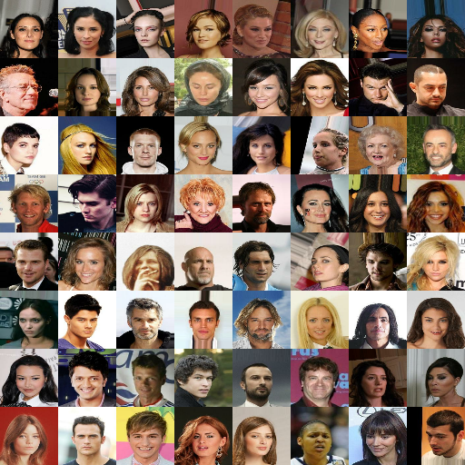
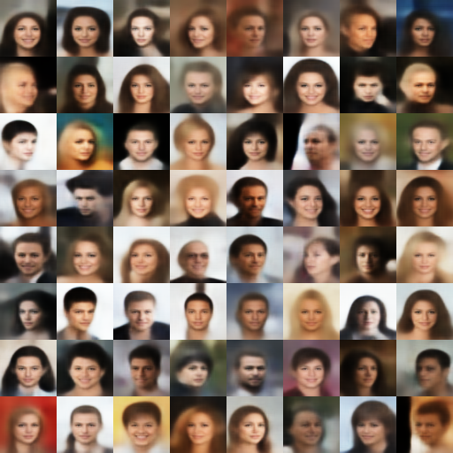
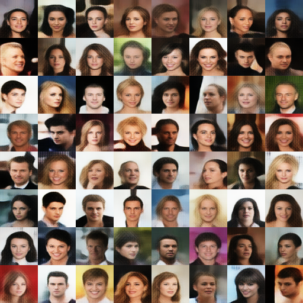
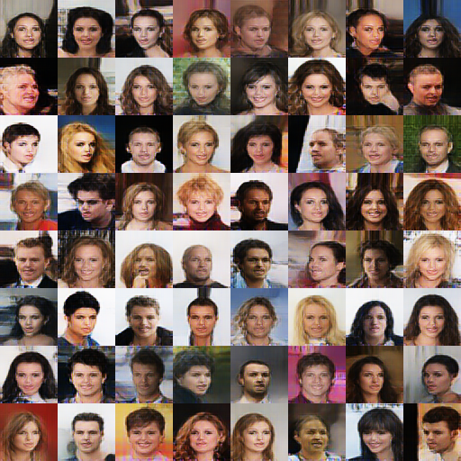
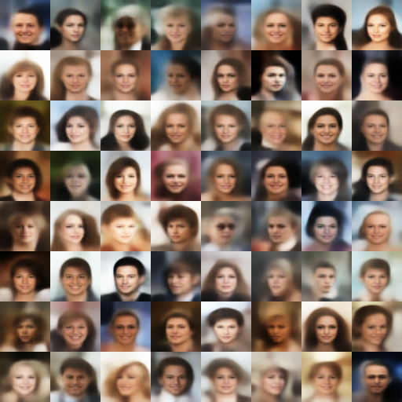
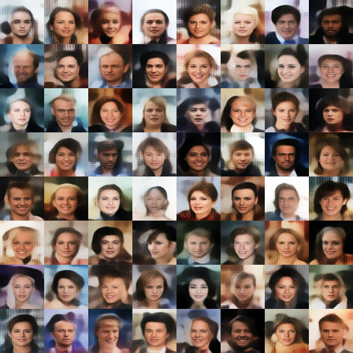
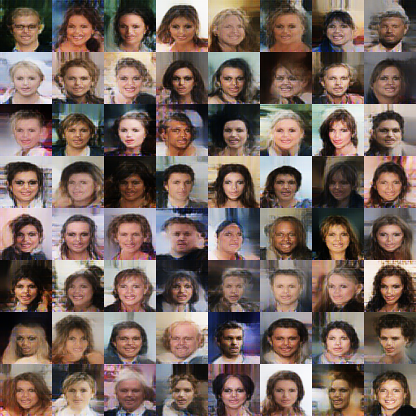

# Deep Feature Consistent Variational Autoencoder

This repository contains the TensorFlow 2 implementation of the Variational Autoencoder described in [Deep Feature Consistent Variational Autoencoder](https://arxiv.org/abs/1610.00291) (Hou et al. 2016)

### Requirements 
- Python 3.7 or higher
- Tensorflow 2.2.0
- numpy
- opencv
- matplotlib

The other requirement is the CelebA dataset. The models from this repository were trained on CelebA Align&Cropped Images. For more details about the CelebA dataset, please refer to [Large-scale CelebFaces Attributes (CelebA) Dataset](http://mmlab.ie.cuhk.edu.hk/projects/CelebA.html).


### Training
To train the model, set config parameters in config.py first and run the following command: 

```python
python main.py --model [name]
```
The model can be seleted from "VAE", "VAE_123" or "VAE_345", where:
- VAE: plain model trained with pixel-by-pixel loss
- VAE-123: model trained by using VGG19 layers relu1_1, relu2_1, relu3_1 for the feature perceptual loss 
- VAE-345: model trained by using VGG19 layers relu3_1, relu4_1, relu5_1 for the feature perceptual loss


### Results

#### 1. Reconstruction
|  Original Images | Plain VAE | DFC VAE-123 | DFC VAE-345 |
:--------------:|:--------------:|:--------------:|:--------------:
|  | |

#### 2. Sample
| Plain VAE | DFC VAE-123 | DFC VAE-345 |
:--------------:|:--------------:|:--------------:
 | |